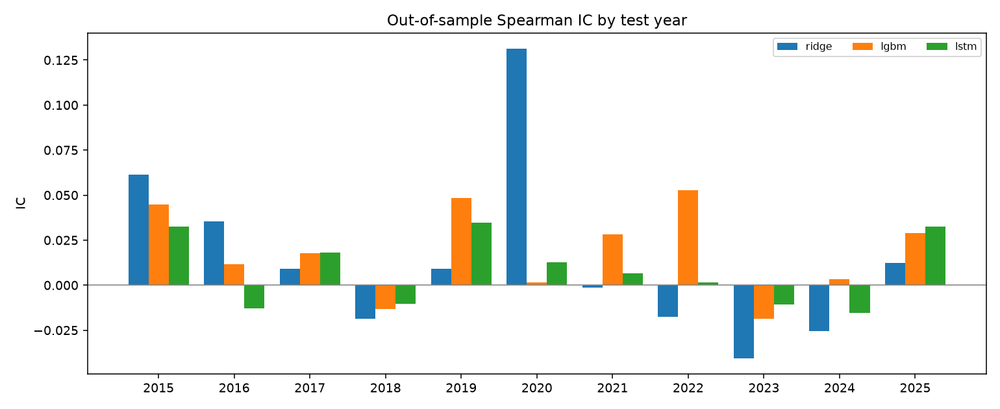
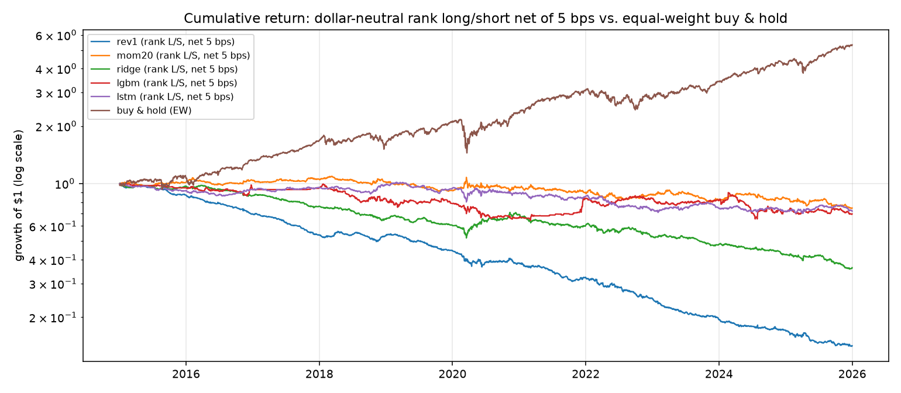
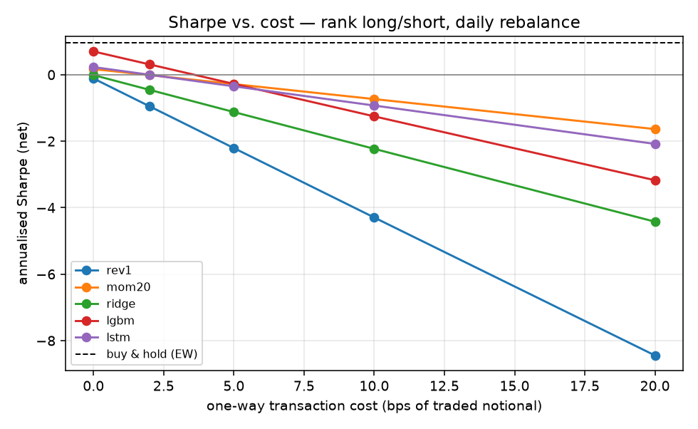

# Is there exploitable predictability in daily stock returns?
### A walk-forward test of an LSTM against random-walk, linear, and tree baselines — replicated on two samples

**TL;DR.** Two independent samples, same code, same pre-registered plan:

* **Sample A** — 20 large US stocks, 12 walk-forward test years (2006–2017), 55,002 out-of-sample stock-days.
* **Sample B** — 31 large US stocks, 11 walk-forward test years (2015–2025), 85,746 out-of-sample stock-days, data through Sep 2026.

In neither sample does any model — ridge, LightGBM, or a stacked LSTM — beat the "always long" rule on
directional accuracy (A: 51.13% vs. 51.04%, p = 0.71; B: 52.04% vs. 52.33%, p = 0.08). The long/short Sharpe
ratios that look attractive at zero cost are mostly equity premium: the models predict "up" 66–89% of the time
and their P&L is 0.5–0.9 correlated with buy-and-hold. Dollar-neutral, every learned signal has a net Sharpe
≤ 0 at 5 bps per trade in both samples. And the *ranking* of the models flips between samples — ridge beat the
LSTM in 10 of 12 years in A, the LSTM beat ridge in 8 of 11 years in B — while all of them stay within noise of
zero, which is what "no robust signal" looks like. Ridge's entire pooled IC in Sample B comes from the March
2020 crash; excluding 2020 it is −0.002.

---

## 1. Research question and pre-registered plan

**Question.** Using only past prices, is next-day return predictable out of sample, and does a recurrent neural
network extract more of that predictability than simple models?

**Hypotheses (written before running anything).**
* H0: daily returns are unpredictable → IC ≈ 0, hit rate ≈ share of up days, OOS R² ≤ 0.
* H1: a small, exploitable signal exists → pooled IC > 0.02 with t > 2, and a dollar-neutral strategy earns
  net Sharpe > 0.5 at 5 bps one-way cost in at least half of the test years.
* H2 (the "LSTM" claim): the LSTM beats ridge regression on IC in a majority of test years.

**Decision rule.** Only the test-year predictions count. Hyper-parameters (ridge α, LightGBM leaves / rounds,
LSTM epochs) are chosen on the validation year, never on the test year. Results are reported per year and pooled.
Sample B was run after Sample A with no changes to code, features, or settings — it is a replication, not a
re-tune.

## 2. Data

| | Sample A | Sample B |
|---|---|---|
| Universe | 20 stocks: AAPL AMD AMZN BABA BAC BBY FB GE GM GOOG JPM MA PFE RRC SBUX SHLD T UAA WMT XOM | 31 stocks: AAPL AMZN BA BAC CAT CSCO CVX DIS GE GOOG GS HD INTC JNJ JPM KO MCD MMM MRK MSFT NVDA ORCL PEP PFE PG T UNH VZ WFC WMT XOM |
| Fields | daily adjusted close only | daily adjusted close only |
| Span | 1995-01-03 … 2018-04-11 (5,860 days) | 2005-01-03 … 2026-09-15 (5,459 days) |
| Test years | 2006–2017 (12) | 2015–2025 (11) |
| Source | static CSV in the [PyPortfolioOpt](https://github.com/robertmartin8/PyPortfolioOpt) repo (no API key needed) | Yahoo Finance via `yfinance`, snapshot taken 2026-09-16 and committed as `data/stock_prices_yf_31.csv` |

Both universes are hand-picked, mostly-survivor large caps (Sample B is today's mega caps as of 2026), so
both carry survivorship bias — the equal-weight buy-and-hold benchmark in Sample B has a Sharpe of 0.97, which
is the bias showing. Close-only data means no volume or intraday features. See §7.

## 3. Method

**Target.** Forward 1-day log return (`--horizon` is configurable). Direction is scored separately from level.

**Features (18, all point-in-time).** 1/5/20/60-day log returns, 20/60-day realised vol, vol-normalised
return, vol ratio, distance from 20/60-day moving averages and the 60-day high, equal-weight universe return /
momentum / vol, and day-of-week dummies. Every feature at date *t* uses prices ≤ *t*; this is enforced by
`tests/test_no_lookahead.py`, which (a) recomputes features on a truncated history and asserts equality, and
(b) scrambles all future prices and asserts nothing before the cutoff changes.

**Validation.** Walk-forward by calendar year: for test year *T*, train on all years < *T−1*, validate on
*T−1*, test on *T*. A purge gap of `horizon` days is removed from the end of the training and validation
windows so no training target overlaps the test period. Feature scaling uses training-fold statistics only.

**Model ladder (identical evaluation for all).**

| model | what it is | tuned on validation |
|---|---|---|
| `zero` | random walk: predicted return = 0 (hit rate = share of up days) | – |
| `rev1` | 1-day reversal rule: predict −(yesterday's return) | – |
| `mom20` | 20-day momentum rule: predict the trailing 20-day return | – |
| `ridge` | ridge regression on the 18 features | α ∈ {1 … 1e5} by validation IC |
| `lgbm` | LightGBM regressor, 500-sample min leaf, subsampling, L2 reg | leaves ∈ {7, 31}, early-stopped rounds |
| `lstm` | 2-layer LSTM (32→16 units, dropout 0.2) over the last 20 days of the feature vector, Adam, grad clipping | early stopping on validation loss (≤ 12 epochs) |

**Metrics.** Pooled Spearman IC; mean daily cross-sectional IC with t-stat; hit rate with Wilson 95% CI and a
binomial test against the *up-day share* (the honest bar — a coin that always says "up" already gets 51–52%);
Campbell–Thompson OOS R² against the zero forecast.

**Backtest.** Daily rebalance at the close, held one day, in two forms: `sign` (equal-weight long/short by
predicted sign) and `rank` (dollar-neutral, weights ∝ demeaned cross-sectional rank, Σ|w| = 1). Costs are
charged as *cost_bps × turnover* at 0/2/5/10/20 bps one-way. Benchmark: equal-weight buy-and-hold of the same
universe (costs ignored).

## 4. Results

### 4.1 Sample A — 20 stocks, test years 2006–2017 (n = 55,002)

| model | pooled IC | daily CS IC (t) | hit rate [95% CI] | p vs. up-share | share of "up" predictions | OOS R² |
|---|---|---|---|---|---|---|
| zero | – | – | 51.04% | – | – | 0 |
| rev1 | +0.007 | −0.010 (−1.9) | 50.91% [50.5, 51.3] | 0.52 | 51% | – |
| mom20 | +0.001 | **+0.016 (+3.0)** | 50.18% [49.8, 50.6] | 0.0001 (worse) | 50% | – |
| ridge | **+0.017** | +0.012 (+2.2) | **51.13%** [50.7, 51.5] | 0.71 | 88% | −0.00001 |
| lgbm | +0.001 | +0.002 (+0.4) | 51.03% [50.6, 51.5] | 0.95 | 89% | −0.0018 |
| lstm | −0.008 | +0.001 (+0.1) | 50.18% [49.8, 50.6] | 0.0001 (worse) | 83% | −0.0013 |

Ridge has a positive pooled IC in 11 of 12 years; LightGBM in 7; the LSTM in 5. Ridge beats the LSTM on IC in
10 of 12 years.

| backtest (net Sharpe @ 0 / 5 / 10 bps) | ridge | lgbm | lstm | mom20 | rev1 | buy & hold (EW) |
|---|---|---|---|---|---|---|
| sign long/short | 0.69 / 0.54 / 0.39 | 0.78 / 0.61 / 0.44 | 0.30 / 0.23 / 0.15 | 0.12 / −0.04 / −0.19 | 0.16 / −0.69 / −1.54 | 0.68 |
| … corr. with buy & hold | 0.90 | 0.81 | 0.86 | −0.45 | 0.21 | 1.00 |
| rank, dollar-neutral | 0.42 / −0.27 / −0.97 | 0.00 / −0.82 / −1.63 | 0.06 / −0.27 / −0.60 | 0.56 / 0.25 / −0.07 | −0.63 / −2.03 / −3.42 | – |
| … turnover / day | 0.64 | 0.80 | 0.29 | 0.29 | 1.30 | – |


### 4.2 Sample B — 31 stocks, test years 2015–2025 (n = 85,746)

| model | pooled IC | daily CS IC (t) | hit rate [95% CI] | p vs. up-share | share of "up" predictions | OOS R² |
|---|---|---|---|---|---|---|
| zero | – | – | 52.33% | – | – | 0 |
| rev1 | +0.017 | +0.006 (+1.0) | 50.63% [50.3, 51.0] | <0.0001 (worse) | 49% | – |
| mom20 | −0.011 | −0.001 (−0.1) | 49.86% [49.5, 50.2] | <0.0001 (worse) | 53% | – |
| ridge | +0.014 | +0.001 (+0.1) | 51.34% [51.0, 51.7] | <0.0001 (worse) | 71% | +0.0029 |
| lgbm | **+0.019** | +0.008 (+1.4) | **52.04%** [51.7, 52.4] | 0.08 | 87% | −0.0049 |
| lstm | −0.001 | −0.002 (−0.3) | 50.51% [50.2, 50.9] | <0.0001 (worse) | 66% | −0.0027 |

LightGBM has a positive pooled IC in 9 of 11 years; the LSTM in 7; ridge in 6 — and ridge is negative in five
of the last eight. The LSTM beats ridge on IC in 8 of 11 years. Ridge's pooled IC excluding 2020 is −0.002
(LightGBM's is +0.020, the LSTM's −0.002): the 2020 crash, when day-to-day reversals were enormous, gave ridge
and the one-day reversal rule a single-year IC of +0.13 and nothing else.

| backtest (net Sharpe @ 0 / 5 / 10 bps) | ridge | lgbm | lstm | mom20 | rev1 | buy & hold (EW) |
|---|---|---|---|---|---|---|
| sign long/short | 0.83 / 0.31 / −0.22 | 1.10 / 0.87 / 0.64 | 0.26 / 0.02 / −0.23 | −0.12 / −0.32 / −0.51 | 0.43 / −0.59 / −1.60 | 0.97 |
| … corr. with buy & hold | 0.47 | 0.55 | 0.71 | −0.52 | 0.23 | 1.00 |
| rank, dollar-neutral | −0.01 / −1.12 / −2.23 | 0.70 / −0.28 / −1.25 | 0.23 / −0.35 / −0.93 | 0.17 / −0.28 / −0.73 | −0.11 / −2.21 / −4.30 | – |
| … turnover / day | 0.70 | 0.79 | 0.36 | 0.30 | 1.32 | – |





### 4.3 Across the two samples

| | Sample A (2006–17) | Sample B (2015–25) |
|---|---|---|
| Pooled IC — ridge / lgbm / lstm | +0.017 / +0.001 / −0.008 | +0.014 / +0.019 / −0.001 |
| Years with IC > 0 — ridge / lgbm / lstm | 11 / 7 / 5 of 12 | 6 / 9 / 7 of 11 |
| Years LSTM beats ridge | 2 of 12 | 8 of 11 |
| Best hit rate vs. always-long | 51.13% vs. 51.04% (p = 0.71) | 52.04% vs. 52.33% (p = 0.08) |
| Dollar-neutral net Sharpe @ 5 bps — ridge / lgbm / lstm | −0.27 / −0.82 / −0.27 | −1.12 / −0.28 / −0.35 |
| Best dollar-neutral *gross* Sharpe | mom20, 0.56 | lgbm, 0.70 |
| Sign-strategy correlation with buy & hold | 0.81–0.90 | 0.47–0.71 |
| Equal-weight buy & hold Sharpe | 0.68 | 0.97 |

Full tables for each sample: `results/summary.md` and `results_2025/summary.md`; per-year and per-ticker
metrics, backtests at every cost level, every prediction, and the hyper-parameters chosen per fold are in the
CSVs alongside them.

## 5. What the results mean

1. **The models learned the equity premium, not a signal.** In both samples the ML models predict "up" most of
   the time (66–89%), so the sign strategies are mostly long and inherit buy-and-hold's return and drawdowns.
   The correct comparison for a long-biased signal is "always long", and nothing beats it on hit rate in either
   sample. LightGBM in Sample B (net Sharpe 0.87 at 5 bps) is the closest thing to a positive result, and it is
   0.55-correlated with a benchmark whose Sharpe is 0.97.
2. **There is a faint cross-sectional signal, and costs eat it.** Something is there at zero cost — momentum's
   daily IC t-stat of 3.0 in A, LightGBM's dollar-neutral gross Sharpe of 0.70 in B — and it is gone at 5 bps
   because a daily-rebalanced signal with 0.3–0.8 turnover pays for itself every day. Lower turnover, not a
   better model, is the first lever.
3. **The model ranking is not stable, which is itself the finding.** Ridge won Sample A (positive IC 11/12
   years); in Sample B it lost to each of the other two models in 8 of 11 years and its pooled IC is an artefact of one
   crash year. The LSTM went from worst to middle without its pooled IC ever leaving [−0.01, 0]. When the
   ordering of three models flips on a new sample while all three sit within noise of zero, the differences
   between them were never real.
4. **Sequence modelling added capacity, not information.** The LSTM's best validation epoch was 1–3 in most
   folds in both samples — validation loss stopped improving almost immediately — and its hit rate is below
   always-long in both. With 18 hand-built features and a signal-to-noise ratio this low, a linear model is
   already at the information ceiling of daily closes.
5. **Validation IC did not predict test IC.** Ridge's validation IC in 2021 (Sample B) was 0.136 — its highest
   anywhere — followed by a test IC of −0.001. A single hold-out year is not evidence, which is why every fold is
   reported.

**Verdict on the hypotheses.** H0 not rejected in either sample. H1 rejected in both: no dollar-neutral net
Sharpe above zero at 5 bps for any learned model; the only borderline cases are a one-line momentum rule in A
(net Sharpe > 0.5 in 6 of 12 years, 0.25 pooled) and LightGBM's zero-cost Sharpe in B. H2 rejected in A (LSTM
lost to ridge 10/12) and nominally supported in B (8/11) — with a pooled IC of −0.001, which is the point.

## 6. Robustness checks included
* Two samples with different universes, 23 test years in total, spanning 2008, 2011, 2020 and 2022.
* Per-year and per-ticker IC and hit rate for every model.
* Cost sensitivity at 0/2/5/10/20 bps and two portfolio constructions.
* Mechanical no-lookahead tests and a purge-gap test (`pytest tests/`).
* Bit-for-bit reproduction of Sample A on a second machine (macOS/arm64 vs. Linux/x86).

## 7. Limitations (and how to remove them)
* **Survivorship bias.** Both universes were chosen with hindsight; Sample B is today's mega caps. The
  buy-and-hold benchmark is inflated and cross-sectional results may be too. Fix: point-in-time index
  constituents, or a sector-ETF universe.
* **Breadth.** 11–31 names per day makes cross-sectional IC noisy. Fix: 100+ liquid names.
* **Close-only data.** No volume, no intraday range, no overnight/intraday split. First features to add.
* **Single seed, small LSTM.** Sized for a CPU run (5–6 min end-to-end). `--units 200 200 150 --seq-len 50`
  reproduces the tutorial-scale network; several seeds should be averaged before claiming anything.
* **Cost model.** Flat bps on turnover; no borrow cost for shorts, no market impact.
* **No refit on train+validation** before testing — conservative, but leaves data on the table.
* **Sample B's data run to Sep 2026 but the last test year is 2025.** The 2026 rows supply only the forward
  target of the final 2025 test day; they are never trained on, validated on, or tested.

## 8. Reproduce

```bash
python3 -m venv .venv && source .venv/bin/activate
pip install -r requirements.txt            # JAX backend for Keras; or install tensorflow and set KERAS_BACKEND=tensorflow
python -m pytest tests/                    # no-lookahead + purge tests

# Sample A (static data, no API key; ≈5 min on one CPU core; results/ is checkpointed per fold)
python -m src.run

# Sample B (uses the committed Yahoo snapshot; delete data/stock_prices_yf_31.csv to re-download)
python -m src.run --source yfinance --start 2005-01-01 --test-years 2015-2025 --out results_2025 \
  --tickers AAPL MSFT AMZN GOOG NVDA JPM BAC WFC GS XOM CVX PFE JNJ MRK UNH PG KO PEP WMT HD MCD DIS CSCO INTC ORCL CAT GE MMM BA T VZ

# Variations
python -m src.run --horizon 5 --out results_h5                                          # weekly horizon
python -m src.run --models zero ridge lstm --units 200 200 150 --seq-len 50 --epochs 30 # tutorial-scale LSTM
```

## 9. Repository layout
```
src/data.py          price loading (static GitHub CSV or yfinance), cached to data/
src/features.py      point-in-time features + forward-return target
src/validation.py    walk-forward yearly folds with purge gap
src/models.py        zero / rule / ridge / LightGBM / LSTM with one interface; scaler
src/evaluate.py      IC, hit rate + CI, OOS R², backtest with costs, plots
src/run.py           experiment driver; writes predictions, metrics, backtests, plots, summary.md
tests/               mechanical look-ahead and purge tests
data/                the two price panels used above
results/             Sample A outputs        results_2025/   Sample B outputs
```

## 10. Next steps, in order of expected value
1. Weekly horizon with weekly rebalancing — same signals, one fifth of the turnover; the first test of whether
   LightGBM's zero-cost Sharpe in Sample B survives anything.
2. Widen the universe (100+ names, ideally point-in-time constituents) and add volume / overnight-vs-intraday
   features.
3. Predict direction as a calibrated probability and trade only high-confidence days.
4. Multiple seeds and a deflated-Sharpe / multiple-testing correction across the model ladder.
5. Only then: bigger sequence models.
