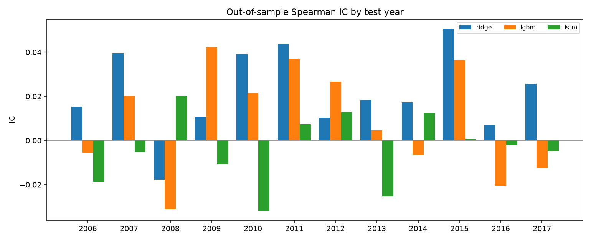
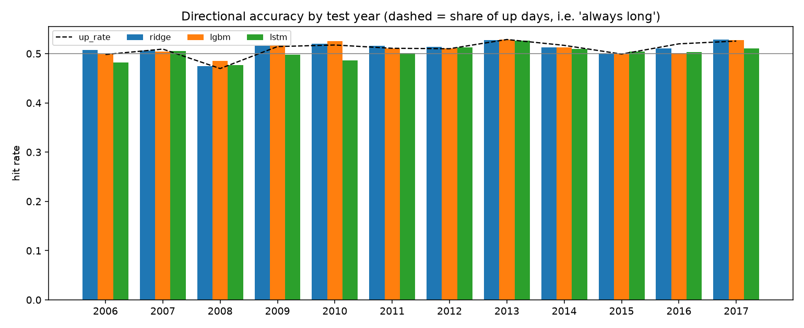
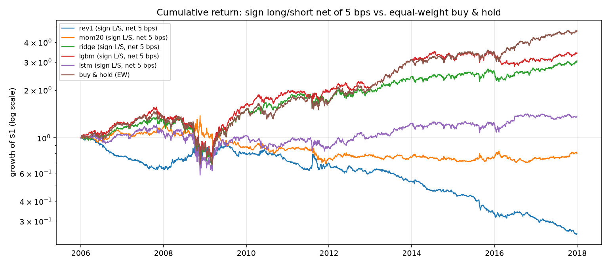
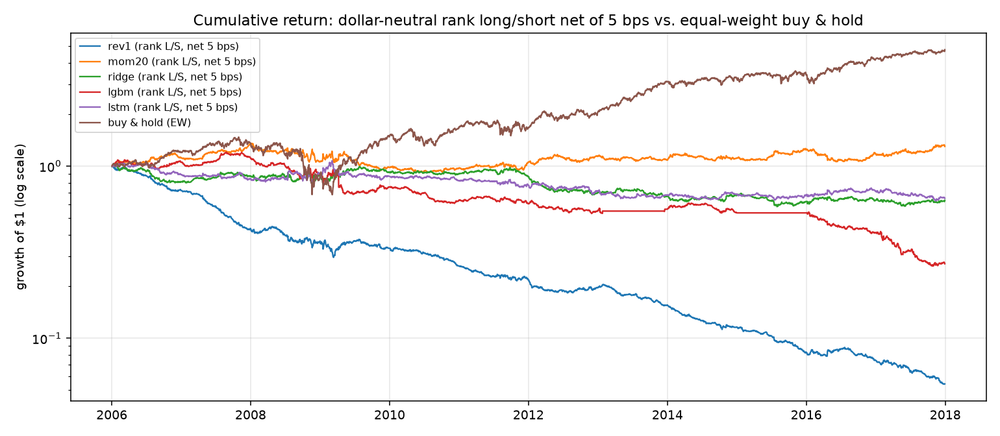
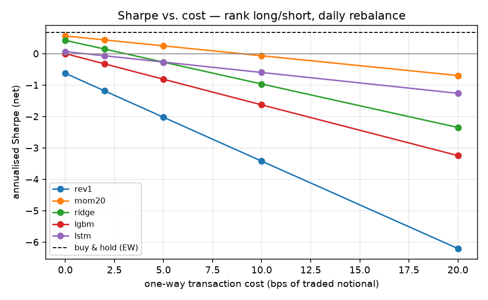

# Is there exploitable predictability in daily stock returns?
### A walk-forward test of an LSTM against random-walk, linear, and tree baselines

**TL;DR.** On 20 large US stocks (1995–2018, 55,002 out-of-sample stock-days across 12 walk-forward test years),
none of the models — ridge, LightGBM, or a stacked LSTM — beat the "always long" rule on directional accuracy
(51.13% vs. 51.04% for the best model, p = 0.71). The apparent Sharpe of the long/short strategies (0.5–0.6 net)
is the equity premium in disguise: the models predict "up" 83–89% of the time and their P&L is 0.8–0.9 correlated
with buy-and-hold. Once dollar-neutral, every learned signal has a net Sharpe ≤ 0 at 5 bps per trade.
The LSTM was the *worst* learned model (pooled IC −0.008, below the linear baseline in 10 of 12 years).
A one-line 20-day momentum rule had the strongest cross-sectional signal (daily IC t-stat 3.0) — and still did not
survive realistic costs.

---

## 1. Research question and pre-registered plan

**Question.** Using only past prices, is next-day return predictable out of sample, and does a recurrent neural
network extract more of that predictability than simple models?

**Hypotheses (written before running anything).**
* H0: daily returns are unpredictable → IC ≈ 0, hit rate ≈ share of up days, OOS R² ≤ 0.
* H1: a small, exploitable signal exists → pooled IC > 0.02 with t > 2, and a dollar-neutral strategy earns
  net Sharpe > 0.5 at 5 bps one-way cost in at least half of the test years.
* H2 (the "LSTM" claim): the LSTM beats ridge regression on IC in a majority of test years.

**Decision rule.** Only the test-year predictions count. Hyper-parameters (ridge α, LightGBM leaves / rounds,
LSTM epochs) are chosen on the validation year, never on the test year. Results are reported per year and pooled.

## 2. Data

| | |
|---|---|
| Universe | 20 large US stocks: AAPL AMD AMZN BABA BAC BBY FB GE GM GOOG JPM MA PFE RRC SBUX SHLD T UAA WMT XOM |
| Fields | daily **adjusted close** only (no volume) |
| Span | 1995-01-03 … 2018-04-11 (5,860 trading days); test years 2006–2017 |
| Source | static CSV in the [PyPortfolioOpt](https://github.com/robertmartin8/PyPortfolioOpt) repo, chosen so the run is fully reproducible without an API key. `--source yfinance` re-runs the same study on live data. |

Known biases: the universe is a hand-picked set of (mostly) survivors as of 2018, which flatters the long-only
benchmark; close-only data means no volume or intraday features. Both are discussed in §7.

## 3. Method

**Target.** Forward 1-day log return (`--horizon` is configurable). The direction of the return is scored
separately from its level.

**Features (18, all point-in-time).** 1/5/20/60-day log returns, 20/60-day realised vol, vol-normalised
return, vol ratio, distance from 20/60-day moving averages and the 60-day high, equal-weight universe return /
momentum / vol, and day-of-week dummies. Every feature at date *t* uses prices ≤ *t*; this is enforced by
`tests/test_no_lookahead.py`, which (a) recomputes features on a truncated history and asserts equality, and
(b) scrambles all future prices and asserts nothing before the cutoff changes.

**Validation.** Walk-forward by calendar year: for test year *T*, train on all years < *T−1*, validate on
*T−1*, test on *T*. A purge gap of `horizon` days is removed from the end of the training and validation
windows so no training target overlaps the test period. Feature scaling uses training-fold statistics only.

**Model ladder (identical evaluation for all).**

| model | what it is | tuned on validation |
|---|---|---|
| `zero` | random walk: predicted return = 0 (hit rate = share of up days) | – |
| `rev1` | 1-day reversal rule: predict −(yesterday's return) | – |
| `mom20` | 20-day momentum rule: predict the trailing 20-day return | – |
| `ridge` | ridge regression on the 18 features | α ∈ {1 … 1e5} by validation IC |
| `lgbm` | LightGBM regressor, 500-sample min leaf, subsampling, L2 reg | leaves ∈ {7, 31}, early-stopped rounds |
| `lstm` | 2-layer LSTM (32→16 units, dropout 0.2) over the last 20 days of the feature vector, Adam, grad clipping | early stopping on validation loss (≤ 12 epochs) |

**Metrics.** Pooled Spearman IC; mean daily cross-sectional IC with t-stat; hit rate with Wilson 95% CI and a
binomial test against the *up-day share* (the honest bar — a coin that always says "up" already gets 51%);
Campbell–Thompson OOS R² against the zero forecast.

**Backtest.** Daily rebalance at the close, held one day, in two forms: `sign` (equal-weight long/short by
predicted sign) and `rank` (dollar-neutral, weights ∝ demeaned cross-sectional rank, Σ|w| = 1). Costs are
charged as *cost_bps × turnover* at 0/2/5/10/20 bps one-way. Benchmark: equal-weight buy-and-hold of the same
universe (costs ignored).

## 4. Results

### 4.1 Signal quality, pooled over 2006–2017 (n = 55,002 stock-days)

| model | pooled IC | daily CS IC (t) | hit rate [95% CI] | p vs. up-share | share of "up" predictions | OOS R² |
|---|---|---|---|---|---|---|
| zero | – | – | 51.04% | – | – | 0 |
| rev1 | +0.007 | −0.010 (−1.9) | 50.91% [50.5, 51.3] | 0.52 | 51% | – |
| mom20 | +0.001 | **+0.016 (+3.0)** | 50.18% [49.8, 50.6] | 0.0001 (worse) | 50% | – |
| ridge | **+0.017** | +0.012 (+2.2) | **51.13%** [50.7, 51.5] | 0.71 | 88% | −0.00001 |
| lgbm | +0.001 | +0.002 (+0.4) | 51.03% [50.6, 51.5] | 0.95 | 89% | −0.0018 |
| lstm | −0.008 | +0.001 (+0.1) | 50.18% [49.8, 50.6] | 0.0001 (worse) | 83% | −0.0013 |




Ridge has a positive pooled IC in 11 of 12 years (every year but 2008); LightGBM in 7; the LSTM in 5.
Ridge beats the LSTM on IC in 10 of 12 years. No model's OOS R² is distinguishable from zero.

### 4.2 Backtests

**Sign long/short, daily rebalance** (looks good until you read the last two columns):

| model | net Sharpe @0 / 5 / 10 bps | max DD | turnover/day | corr. with buy-and-hold | share long |
|---|---|---|---|---|---|
| ridge | 0.69 / 0.54 / 0.39 | −51% | 0.25 | **0.90** | 88% |
| lgbm | 0.78 / 0.61 / 0.44 | −54% | 0.28 | **0.81** | 89% |
| lstm | 0.30 / 0.23 / 0.15 | −52% | 0.12 | **0.86** | 83% |
| mom20 | 0.12 / −0.04 / −0.19 | −50% | 0.20 | −0.45 | 50% |
| rev1 | 0.16 / −0.69 / −1.54 | −76% | 1.02 | 0.21 | 51% |
| buy-and-hold (EW) | 0.68 | −54% | – | 1.00 | 100% |

**Rank long/short, dollar-neutral** (the actual alpha test):

| model | net Sharpe @0 / 5 / 10 bps | max DD @5 bps | turnover/day | corr. with buy-and-hold |
|---|---|---|---|---|
| mom20 | 0.56 / 0.25 / −0.07 | −32% | 0.29 | −0.12 |
| ridge | 0.42 / −0.27 / −0.97 | −42% | 0.64 | 0.07 |
| lstm | 0.06 / −0.27 / −0.60 | −42% | 0.29 | −0.03 |
| lgbm | 0.00 / −0.82 / −1.63 | −78% | 0.80 | 0.05 |
| rev1 | −0.63 / −2.03 / −3.42 | −95% | 1.30 | 0.09 |





Full tables: `results/summary.md`, `results/backtest.csv`, `results/metrics_by_year.csv`,
`results/metrics_by_ticker.csv`; every prediction in `results/predictions.csv`; chosen hyper-parameters per
fold in `results/fold_log.csv`.

## 5. What the results mean

1. **The models learned the equity premium, not a signal.** 83–89% of ML predictions are positive, so the
   sign strategies are mostly long and inherit buy-and-hold's return, volatility, 2008 drawdown and Sharpe.
   The correct comparison for a long-biased signal is "always long", and nothing beats it on hit rate.
2. **There is a faint cross-sectional signal, and costs eat it.** Ridge's daily cross-sectional IC (0.012,
   t = 2.2) and the 20-day momentum rule (0.016, t = 3.0) are consistent with the well-documented, weak
   short-horizon momentum effect. Gross Sharpe 0.4–0.6 becomes ≤ 0.25 at 5 bps and negative at 10 bps because
   a daily-rebalanced signal with 0.3–0.6 turnover pays for itself every day. Lower turnover, not a better
   model, is the first lever.
3. **The LSTM added capacity, not information.** The best validation epoch was 1–3 in 9 of 12 folds — the
   validation loss stopped improving almost immediately — and the model ended below both the linear
   baseline and the always-long rule. With 18 hand-built features on ~50k–80k samples and a signal-to-noise
   ratio this low, a linear model is already at the information ceiling; sequence modelling has nothing
   extra to learn from daily closes. (LightGBM shows the same thing from the other side: in two folds it
   early-stopped after a single tree, in a third after three.)
4. **Validation IC did not predict test IC.** In 2008 ridge and LightGBM had validation ICs of 0.06–0.07
   and test ICs of −0.02 and −0.03; the LSTM's best validation year (2013, IC 0.06) was followed by a test IC
   of −0.025. A single hold-out year is not evidence, which is why every fold is reported.

**Verdict on the hypotheses.** H0 not rejected for the learned models. H1 rejected for ridge, LightGBM and
the LSTM (pooled dollar-neutral net Sharpe ≤ 0 at 5 bps; > 0.5 in at most 2 of 12 years). The 20-day momentum
*rule* is the one borderline case: cross-sectional IC 0.016 (t = 3.0, just under the 0.02 bar) and a net
Sharpe > 0.5 in exactly 6 of 12 years but only 0.25 pooled — the only lead here worth following up, and it is a
one-line rule, not a neural network. H2 rejected (LSTM lost to ridge in 10/12 years).

## 6. Robustness checks included
* 12 independent test years spanning 2008 and 2011 (per-year tables and plots).
* Per-ticker IC and hit rate (`metrics_by_ticker.csv`).
* Cost sensitivity at 0/2/5/10/20 bps and two portfolio constructions.
* Mechanical no-lookahead tests and a purge-gap test (`pytest tests/`).

## 7. Limitations (and how to remove them)
* **Survivorship bias.** The 20 names were chosen in 2018; the buy-and-hold benchmark is inflated and
  cross-sectional results may be too. Fix: point-in-time index constituents, or an ETF/sector universe.
* **Breadth.** 11–20 names per day makes cross-sectional IC noisy. Fix: 100+ liquid names via `--source yfinance`.
* **Close-only data.** No volume, no intraday range, no overnight/intraday split. These are the first
  features to add; the pipeline takes any wide price panel.
* **Single seed, small LSTM.** Sized for a CPU run (5 min end-to-end). `--units 200 200 150 --seq-len 50`
  reproduces the tutorial-scale network; multiple seeds should be averaged before claiming anything.
* **Cost model.** Flat bps on turnover; no borrow cost for shorts, no market impact, no rebalancing drift.
* **No refit on train+validation** before testing — conservative, but leaves data on the table.
* **Sample ends April 2018.** Re-run with `--source yfinance --test-years 2015-2025` for current data.

## 8. Reproduce

```bash
python -m venv .venv && source .venv/bin/activate
pip install -r requirements.txt            # JAX backend for Keras; or install tensorflow and set KERAS_BACKEND=tensorflow
python -m pytest tests/                    # no-lookahead + purge tests
python -m src.run                          # full run (≈5 min on one CPU core); results/ is checkpointed per fold
python -m src.run --source yfinance --tickers AAPL MSFT NVDA JPM XOM ... --start 2005-01-01 --test-years 2015-2025
python -m src.run --horizon 5 --out results_h5      # weekly horizon
python -m src.run --models zero ridge lstm --units 200 200 150 --seq-len 50 --epochs 30   # tutorial-scale LSTM
```

## 9. Repository layout
```
src/data.py         price loading (GitHub CSV or yfinance), cached to data/
src/features.py     point-in-time features + forward-return target
src/validation.py   walk-forward yearly folds with purge gap
src/models.py       zero / rule / ridge / LightGBM / LSTM with one interface; scaler
src/evaluate.py     IC, hit rate + CI, OOS R², backtest with costs, plots
src/run.py          experiment driver; writes results/ (predictions, metrics, backtests, plots, summary.md)
tests/              mechanical look-ahead and purge tests
results/            output of the run described above
```

## 10. Next steps, in order of expected value
1. Widen the universe (100+ names) and add volume / overnight-vs-intraday features.
2. Weekly horizon with weekly rebalancing — same signal, one fifth of the turnover.
3. Predict direction as a calibrated probability and trade only high-confidence days.
4. Multiple seeds and a deflated-Sharpe / multiple-testing correction across the model ladder.
5. Only then: bigger sequence models.
